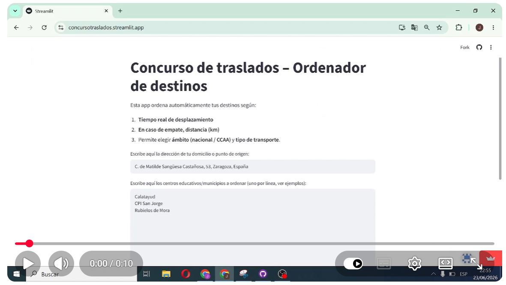

# Concurso de Traslados

Aplicación web desarrollada en Python y Streamlit para calcular distancias entre localidades y centros educativos, facilitando el análisis y ordenación de destinos en concursos de traslados docentes.

## Aplicación

https://concursotraslados.streamlit.app/

## Funcionalidades

- Cálculo automático de distancias.
- Comparación de múltiples destinos.
- Interfaz sencilla orientada a personal docente.
- Consulta rápida desde navegador.

## Tecnologías

- Python
- Streamlit
- Google Maps Distance Matrix API

## Vídeo demostración

## Estructura del proyecto

- traslados.py → aplicación principal.
- core.py → funciones de cálculo
## Autor

Jorge Olleros
